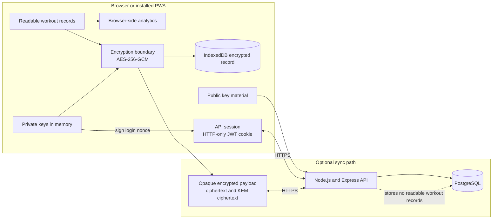

# ZK Fitness

**Live demo:** [Open ZK Fitness](https://samueladegnan.github.io/zk-fitness-platform/)

ZK Fitness is a privacy-first strength and cardio tracker. Workout history can contain sensitive health and lifestyle information. The browser keeps readable records and performs analytics locally. Optional cloud sync sends public key material and encrypted payloads to a Node.js API. PostgreSQL stores the payload without a server-side workout model.

This is a portfolio project. It demonstrates a client-owned encryption boundary and a full-stack product path. It is not presented as a formally audited security product or as evidence of operational reliability.

> **Ownership**
>
> I own the architecture, implementation, testing, security model, and final code for this project.

## Project links

- [Live demo](https://samueladegnan.github.io/zk-fitness-platform/)
- [Source repository](https://github.com/samueladegnan/zk-fitness-platform)
- [Architecture documentation](https://samueladegnan.github.io/zk-fitness-platform/architecture/)
- [Test instructions](https://github.com/samueladegnan/zk-fitness-platform/blob/main/docs/TESTING.md)
- [OpenAPI specification](docs/openapi.yaml)
- [Deployment guide](docs/DEPLOY.md)
- [Automated security report](https://samueladegnan.github.io/zk-fitness-platform/security/)
- [Author portfolio](https://samueladegnan.github.io/)

## Why I built it

Workout history can reveal sensitive health and lifestyle information. I built this project to explore what changes when the client owns the readable record and the server stores only an encrypted representation. The fitness features provide a realistic workload for that privacy boundary. The project also gave me a place to work through browser cryptography, offline persistence, authentication, API design, PostgreSQL, Docker, and CI.

The project name uses “ZK” because account sync now includes a Groth16 proof checked by the API. This is a scoped proof-carrying sync experiment, not a claim that the entire fitness application is a formally verified zero-knowledge vault. The proof covers knowledge of a sensitive workout summary, an identity secret, a commitment, a one-time nullifier, minimum thresholds, and a binding to the submitted encrypted record. It does not prove AES-GCM or ML-KEM internals, and it does not prove that the ciphertext decrypts to the sensitive workout summary. The precise scope is a proof-carrying sync protocol layered on a client-owned encryption boundary.

## What is implemented

- Strength, cardio, and time-based workout logging
- Reusable workout plans and custom exercises
- Exercise search, history, charts, personal records, XP, levels, badges, streaks, and local analytics
- Local mode without an account
- IndexedDB persistence of encrypted local records
- An installable PWA app shell with service-worker caching for static assets
- Optional account mode with challenge-response login and an HTTP-only JWT session cookie
- Optional encrypted sync through a Node.js and Express API
- Groth16 workout-validity proofs generated in the browser and verified by the API
- Poseidon identity commitments and one-time nullifiers for proof identity and replay checks
- PostgreSQL persistence for public keys, encrypted workout payloads, proof metadata, and nullifiers
- Argon2id and HKDF key derivation in the browser
- AES-256-GCM workout payload encryption
- ML-DSA-65 login signatures
- ML-KEM-768 encapsulation of a fresh sync data key
- API input limits, rate limiting, account lockout, origin checks, security headers, structured logs, and a database health endpoint
- Docker and Docker Compose support for the API and PostgreSQL
- GitHub Actions workflows for linting, tests, Docker image builds, dependency audit checks, secret pattern checks, and an automated triage report. The backend and frontend runtime audits are enforced in CI. The root ZK development toolchain still reports 15 low-severity advisories through `circomlibjs`, `ethers`, and `elliptic`, which are recorded in the test notes.

## Architecture

The browser is the plaintext boundary. Local mode uses encrypted storage for the demo flow, but its fixed demo key is available to code running in the same origin and it does not run the account proof flow. Account mode derives key material from the user's password and attaches a Groth16 proof to each sync write. In both modes, the API receives an opaque payload rather than a parsed workout record.



### Data flow

1. The user enters a password in the browser.
2. Argon2id stretches the password. HKDF expands the result into deterministic seeds for the client key pairs.
3. ML-DSA-65 signs a server-issued login nonce during account login.
4. The client serializes workout records and encrypts them with AES-256-GCM.
5. In account mode, ML-KEM-768 encapsulates a fresh shared secret that becomes the AES data key for that payload.
6. The browser computes a Poseidon commitment and Groth16 proof over the sensitive workout summary, identity secret, nonce, thresholds, and a field binding of the encrypted blob plus KEM ciphertext.
7. IndexedDB stores the encrypted record locally. Optional account sync sends the encrypted record, proof, public signals, and metadata to the API.
8. The API verifies the proof and rejects a reused nullifier before PostgreSQL stores the opaque values. The client retrieves, decapsulates, decrypts, and analyzes the workout records.

The boundary limits what the API can learn from the sensitive workout payload. It does not protect a compromised browser, a compromised device, a weak or reused password, malicious application code, dependency compromise, traffic metadata, deletion, replay, or loss of availability.

## Cryptography decisions

| Concern | Algorithm | Why it is used | What it does not guarantee |
| --- | --- | --- | --- |
| Password-based key material | Argon2id plus HKDF with SHA-256 | Argon2id makes password guessing more expensive. HKDF separates derived material into stable seeds for the client key pairs. | It does not recover a forgotten password, protect a password entered into a compromised browser, or make a weak password safe. |
| Login authentication | ML-DSA-65 | The client signs a short server nonce, so the server can verify possession of the private signing key without receiving it. | It does not prove that the device is trusted, prevent account lockout, or provide a recovery path. |
| Sync data-key encapsulation | ML-KEM-768 | The client creates a fresh shared secret for a payload and sends the KEM ciphertext needed for the client to recover it. | It does not provide availability, conflict resolution, protection from a malicious client, or protection from deletion and replay. |
| Workout payload confidentiality and integrity | AES-256-GCM | A browser-native authenticated encryption primitive protects the serialized workout records and detects modified ciphertext. | It does not protect plaintext while the application is running or hide all metadata such as timing, size, and account activity. |
| Workout validity proof | Groth16 over a Circom circuit with Poseidon | The API can verify a sensitive workout summary, identity secret, minimum thresholds, commitment, nullifier, and encrypted-record binding without receiving the witness values. | It does not prove AES-GCM or ML-KEM internals, prove that ciphertext decrypts to the summary, or protect a compromised browser. |
| Commitment and nullifier hashing | Poseidon | It is circuit-friendly for identity commitments, state commitments, and replay identifiers. | It does not provide confidentiality by itself or prevent deletion and denial of service. |
| Registration abuse control | SHA-256 proof of work | The client must solve a small computational challenge before registration. | It is not identity verification, bot prevention at scale, or a substitute for rate limits and monitoring. |

### Why post-quantum algorithms are here

ML-DSA-65 and ML-KEM-768 are an engineering exploration in this portfolio. A fitness tracker does not commercially require post-quantum cryptography simply because these algorithms are interesting. I included them to learn how larger public keys, challenge-response authentication, key encapsulation, browser execution, and server storage interact in a real application. The project should not be read as a claim that its cryptographic choices have been independently audited or that they solve every security problem.

## What is not implemented

- No independent penetration test, cryptographic review, formal threat-model review, or security certification
- The ZK circuit proves the declared sensitive workout summary and its encrypted-record binding. It does not prove the AES-GCM or ML-KEM algorithms, and it does not prove that the ciphertext decrypts to the summary
- No claim that the automated tests cover every browser, device, account state, network failure, and recovery path
- No dedicated automated browser test for expired sessions, missing keys, or IndexedDB recovery. AES-GCM corruption and wrong-key behavior have focused frontend unit coverage
- No cross-device Playwright scenario. The proof-carrying sync protocol exists, but concurrent editing and conflict resolution are not implemented
- No password reset or account recovery flow. Losing the password can make deterministic client key material unrecoverable
- No server-side plaintext search, analytics, sharing, collaboration, or social features
- No high-availability design, backup policy, service-level objective, alerting system, or evidence of operational performance
- No evidence of uptime, backups, monitoring, incident response, or other operational guarantees for a configured deployment
- No guarantee that the local demo protects data from code running in the same browser origin because its demonstration key is fixed in the application

## Technology choices

| Layer | Technology |
| --- | --- |
| Frontend | Buildless HTML, CSS, and vanilla JavaScript |
| Browser crypto | Web Crypto API, Argon2id, HKDF, ML-DSA-65, ML-KEM-768, Circom, Groth16, and Poseidon |
| Local storage | IndexedDB for encrypted records |
| Backend | Node.js and Express |
| Sessions | HTTP-only JWT cookies |
| Database | PostgreSQL |
| Operations | Docker, Docker Compose, Render configuration, and GitHub Actions |
| Quality tools | ESLint, Node's built-in test runner, Supertest, and Playwright |

The frontend stays buildless so the deployed client is easy to inspect. Argon2 and the post-quantum bundle are vendored for the browser app. JSDoc and `jsconfig.json` provide editor support and JavaScript checking without a transpiler.

## Local setup

### Prerequisites

- Node.js 20 or newer
- npm
- Docker Desktop with Docker Compose
- Python 3 for the static Pages build and local secret scan

### Install dependencies

```bash
git clone https://github.com/samueladegnan/zk-fitness-platform.git
cd zk-fitness-platform
npm ci
npm run install:frontend
npm run install:backend
npx playwright install chromium
```

### Configure and start the API

In Git Bash or another POSIX shell:

```bash
cp backend/.env.example backend/.env
npm run dev:infra
npm run migrate
npm run dev:api
```

Open a second terminal and serve the frontend:

```bash
npm run dev:client
```

Open [http://localhost:3001](http://localhost:3001). Local mode works without the API. Account mode and cloud sync use the API and PostgreSQL.

To stop the local database and API processes:

```bash
docker compose down
npm run dev:stop
```

### Refresh vendored browser assets

Run these commands after changing the related dependency versions:

```bash
npm run copy-argon2
npm run build:pqc
```

## Checks and builds

The full command list and test matrix are in [docs/TESTING.md](docs/TESTING.md). The security report workflow is a CI integration that needs the pinned Guardrail CLI. `npm run security:guardrail` generates ESLint SARIF input, runs the CLI with the deterministic mock provider, and writes local report files.

```bash
npm run test:unit
npm run test:integration
npm run test:e2e
npm run lint
npm run security:audit
npm run security:secrets
npm run build:pages
```

The backend integration tests require the PostgreSQL service. The backend test command uses Node's force-exit test flag because Groth16 proving uses worker resources. The Playwright tests start the frontend server automatically when `ZK_E2E_BASE_URL` is not set. The Pages build writes generated output to the ignored `site/` directory.

## Test scope

| Scenario | Current implementation | Automated evidence |
| --- | --- | --- |
| Offline mode | Local mode works without an account. The service worker caches the static app shell and does not intercept API requests. | Playwright exercises the local trial flow. Offline network behavior is not isolated in a dedicated test. |
| IndexedDB persistence | Encrypted records are saved, loaded, and deleted through the IndexedDB helper. | Implementation is covered by the app path. There is no dedicated IndexedDB test in the current suite. |
| Corrupted ciphertext | AES-GCM decryption rejects modified authenticated ciphertext. | Frontend crypto unit coverage verifies modified ciphertext is rejected. |
| Wrong key | AES-GCM or ML-KEM decapsulation fails before readable state is returned. | Frontend crypto unit coverage verifies the AES-GCM wrong-key path. | No browser KEM decapsulation failure test. |
| Expired session | JWT verification rejects an invalid or expired session and returns HTTP 401. | Unauthenticated session and sync requests are tested. Expiry itself is not isolated in a test. |
| Failed sync | The client keeps a local copy and reports that cloud sync is unavailable. | The fallback exists in `app.js`. There is no dedicated network-failure test. |
| Missing key | The client refuses to decrypt when the required KEM key pair is unavailable. | The error path exists in `app.js`. There is no dedicated test. |
| Cross-device sync | Account mode stores an encrypted payload that another device can retrieve when it can recreate the client keys. | API sync lifecycle tests cover storage and retrieval. There is no two-browser cross-device test or conflict strategy. |

## Deployment notes

GitHub Pages serves the static client and project documentation. The optional backend can run as a Node.js service with PostgreSQL. See [docs/DEPLOY.md](docs/DEPLOY.md) for the Render configuration and required environment variables.

The deployment files describe how to run the system. They do not establish uptime, backups, monitoring, incident response, or other operational guarantees.

## Portfolio context

ZK Fitness is one of three portfolio projects focused on practical engineering boundaries:

- [ZK Fitness](https://samueladegnan.github.io/zk-fitness-platform/)
- [SEEO AWS Orchestrator](https://samueladegnan.github.io/seeo-aws-orchestrator/)
- [AI CI/CD Security Guardrail](https://samueladegnan.github.io/ai-cicd-security-guardrail/)

The root [`portfolio.json`](portfolio.json) file keeps the project description, scope notes, evidence, and technology list aligned with the description card on the main portfolio.

## License

MIT © Samuel Degnan
